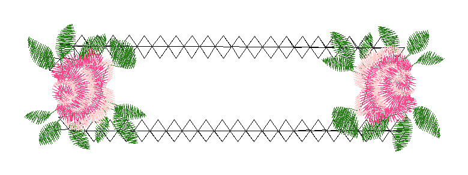

# PES Embroidery Identifier

Ferramenta com interface gráfica para converter arquivos `.pes` em PNG, identificar o bordado com IA e renomear os arquivos automaticamente.



## Funcionalidades

- Visualiza arquivos `.pes` diretamente na interface
- Converte `.pes` → PNG com renderização fiel das cores
- Identifica o bordado via IA e sugere um nome de arquivo
- Renomeia `.pes` e `.png` automaticamente
- Processamento em lote de pastas inteiras (com barra de progresso)
- 4 modos de IA disponíveis (veja abaixo)

## Pré-requisitos

- **Python 3.10 ou superior** — [python.org](https://python.org) (marcar "Add to PATH" na instalação)
- **Ollama** *(apenas para o modo local)* — [ollama.com](https://ollama.com)

## Instalação

```bash
# 1. Clonar o repositório
git clone https://github.com/fbprieto1-creator/pes-identifier
cd pes-identifier

# 2. Instalar dependências e baixar modelo local (GPU ~3 GB)
setup_pc_gpu.bat

# 3. Abrir o programa
run.bat
```

> Também é possível baixar o ZIP diretamente pelo botão **Code → Download ZIP** no GitHub.

## Modos de IA

| Modo | Requisito |
|------|-----------|
| **ChatGPT / OpenAI** | Variável de ambiente `OPENAI_API_KEY` |
| **ChatGPT local (Ollama)** | Ollama rodando + modelo `qwen3-vl:2b-instruct` |
| **Anthropic API** | Variável de ambiente `ANTHROPIC_API_KEY` |
| **Claude Code local** | [Claude Code CLI](https://claude.ai/code) instalado |

### Configurar variável de ambiente (Windows)

Abra o PowerShell e execute:

```powershell
# Para OpenAI
setx OPENAI_API_KEY "sua-chave-aqui"

# Para Anthropic
setx ANTHROPIC_API_KEY "sua-chave-aqui"
```

Reinicie o programa após configurar.

## Dependências Python

```
Pillow
pyembroidery
openai
anthropic
```

Instaladas automaticamente pelo `setup_pc_gpu.bat` ou manualmente com:

```bash
pip install -r requirements.txt
```

## Abas do programa

- **Processar Pasta** — fluxo completo: converter, identificar com IA e renomear todos os `.pes` de uma pasta
- **Arquivo Único** — abre um arquivo, visualiza, identifica e renomeia individualmente
- **Lote Automático** — controle granular sobre cada etapa do processamento em lote
